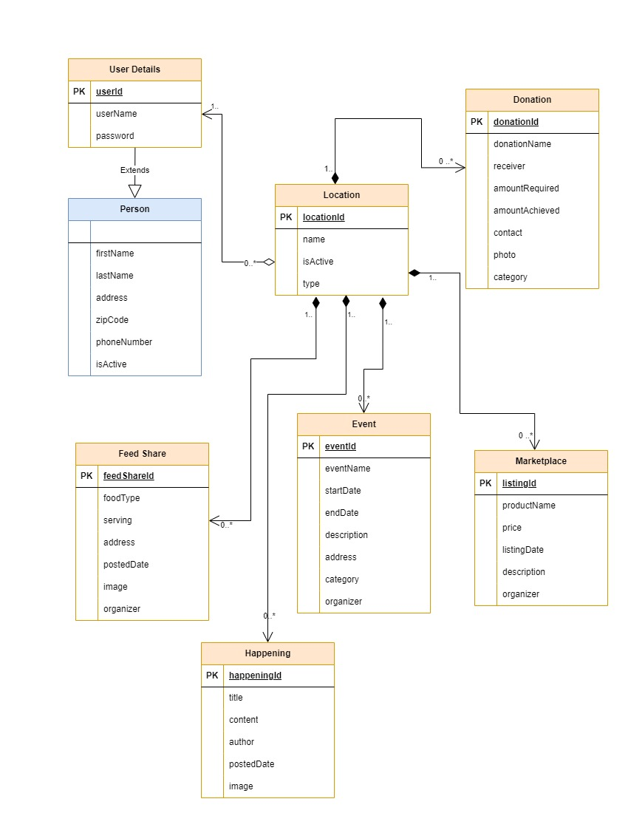

# locAll

## Project Description

Welcome to locAll!
locAll is a community-centric platform designed to connect individuals with local happenings, events, marketplace activities, and community support. Our web application fosters a sense of togetherness by providing a centralized space for location-specific information, creating a vibrant and connected local community.

## Key Features

1. Location-Centric Experience
Navigate through a tailored experience based on your zipcode, ensuring that all information is relevant to your local community.

2. Event Management
Organize and promote local events such as fairs, festivals, and functions, fostering community engagement.

3. Dynamic Marketplace
Buy and sell products within your community. Post detailed listings with images, descriptions, and pricing to engage with local buyers.

4. Real-Time Weather Updates
Stay informed about local weather conditions, ensuring that your outdoor plans are always well-informed.

5. Happenings Feed
Access a single, curated feed showcasing the latest activities, community announcements, and local news in your area.

6. Excess Food Sharing
Contribute to community well-being by sharing or donating excess food, promoting a sustainable and supportive environment.

7. Donation
Support neighbors in need by providing essential donations for various purposes. Strengthen the sense of community care through your generosity

Join locAll today and be an active participant in building a vibrant and connected local community. Together, let's make every neighborhood a better place!

 ### Object Model Diagram

### External APIs

https://docs.mapbox.com/   
https://stripe.com/docs/payments  
https://openweathermap.org/guide  
https://recharts.org/en-US/guide  
https://nominatim.org/release-docs/develop/api/Overview/

 ### Instructions to use the repo
- You can clone the repo by using HTTP: 

[https://github.com/info-6150-fall-2023/final-project-ex-span-dables.git
](https://github.com/ThejusThomson/locALL.git)

OR set up the SSH Key using: 
https://github.com/ThejusThomson/locALL.git

Commands to use: 

git clone `<use HTTP Link or SSH Link>`
